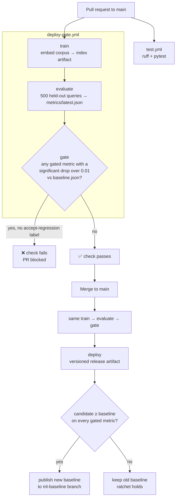

# ml-ci-pipeline


A GitHub Actions pipeline that decides whether a model is allowed to
ship: tests pass **and** accuracy doesn't regress against a committed
baseline. A PR that makes the model worse gets a red check with the
exact metrics that dropped, and can't deploy.

The model under the gate is the retrieval-based UK commodity-code
(HS code) classifier from [hs-code-classifier](https://github.com/Jayden04260/hs-code-classifier):
sentence-transformer embeddings + cosine search + cross-encoder
re-ranking over UK Trade Tariff reference data.

## Pipeline



Every PR gets the gate's metric table as a comment (one comment,
updated in place on each push), and every run has it in the job
summary:

| metric | baseline | candidate | delta | 95% CI of delta | gated | |
|---|---|---|---|---|---|---|
| top1 | 0.4180 | 0.3760 | -0.0420 | [-0.0780, -0.0040] | yes | FAIL |
| top3 | 0.5980 | 0.5760 | -0.0220 | [-0.0520, +0.0080] | no | down |
| top5 | 0.6840 | 0.6600 | -0.0240 | [-0.0500, +0.0020] | yes | down, not significant |
| mrr | 0.5169 | 0.4814 | -0.0355 | [-0.0612, -0.0102] | yes | FAIL |
| heading_top1 | 0.5580 | 0.4860 | -0.0720 | - | no | down |
| chapter_top1 | 0.7520 | 0.7100 | -0.0420 | - | no | down |

(Real output, not a mock-up: this is what the gate reports if
cross-encoder re-ranking is switched off - a plausible "simplify the
pipeline" change that quietly costs 4 points of top-1 accuracy. Note
top-5: it dropped 2.4 points, but its confidence interval crosses zero,
so on its own that drop isn't treated as evidence of a worse model.)

## Design decisions

**What "training" means here.** There are no fine-tuned weights - the
model is a retrieval index. `model/train.py` embeds the corpus and
writes a self-contained artifact (`embeddings.npy`, `references.json`,
`manifest.json` with model names, data sha256 and git sha). What a PR
can change - the corpus, the embedding/rerank model, the retrieval or
dedup logic - all flows through that artifact, so it's what gets
evaluated and what gets shipped.

**A deterministic eval, so the gate measures the PR and nothing else.**
The held-out split, the 500-query subsample, and CPU inference are all
seeded or seed-free. Running `evaluate` twice on the same commit gives
the same numbers, so any metric movement is caused by the change under
review, not a different random draw. `evaluate.check_no_leakage` also
fails the run outright if any eval query appears verbatim in the index,
which would silently inflate every number.

**The gate rule** (`model/gate.py`): `top1`, `top5` or `mrr` counts as
regressed only if it **both** dropped more than **0.01** below baseline
(one percentage point = 5 of 500 queries) **and** the drop is
statistically significant - the 95% paired-bootstrap confidence interval
of the change lies entirely below zero.

- *Why a tolerance:* a significant but tiny drop isn't worth blocking a
  PR over. Absolute points rather than relative %, so the rule means the
  same for a 0.42 metric as a 0.68 one.
- *Why significance:* on 500 queries, a 1-point drop is 5 questions.
  Most queries score identically under both models, so what matters is
  how many changed and in which direction - 16 got worse while 10 got
  better is a very different story from 6 worse and none better, even
  though both net out to about -1 point. The bootstrap resamples queries
  with each query's before/after pair kept together, which measures
  exactly that. It's seeded, so a given pair of results always gets the
  same verdict.
- Heading/chapter accuracy are reported but not gated - they mostly move
  with top-1.

**The eval set has to match exactly.** Each result records a sha256 of
the exact query list (`eval_set_sha256`). If it differs from the
baseline's - e.g. a refreshed data snapshot changed which titles are
held out, even with the same count - the gate reports *not comparable*
instead of a misleading pass or fail, and the PR needs
`accept-regression` to set a new baseline. A change to the *index* data
alone (same queries) is still compared, and flagged in the report.

**The baseline ratchets.** After a successful deploy, the baseline is
only replaced if the new model is at least as good on *every* gated
metric. A PR whose drop is within tolerance, or not significant, passes
and ships - but the bar stays where it was. Repeated small drops keep
being measured against the same baseline, so they add up until they're
significant, instead of each one quietly lowering the bar.

**Deliberate regressions are explicit.** Sometimes a regression is the
right call (a faster or smaller model that loses a point). Label the PR
`accept-regression`: the gate still reports the table but doesn't
block, and on merge the baseline is reset to the new numbers. The
workflow looks the label up from the merge commit's PR, so the decision
is recorded on the PR where reviewers saw it. `workflow_dispatch` with
`accept_regression` does the same without a PR.

**Deploy is a mock, on purpose.** The `deploy` job (GitHub
`production` environment) packages the gate-approved artifact + the
metrics it passed with into a versioned `release-<sha>` artifact. The
workflow comments show where a real target slots in (S3 upload + Lambda
config update, the same pattern as
[emotisense](https://github.com/Jayden04260/emotisense) and
[churnwatch](https://github.com/Jayden04260/churnwatch)) - the point
of this repo is the gate in front of the deploy, not the deploy itself.

**CI cost.** CPU-only torch wheel (skips ~2GB of CUDA libraries), pip
and Hugging Face model caches keyed on the model-name files. A full
train + evaluate is ~4 minutes.

## Current baseline

| top-1 | top-3 | top-5 | MRR | heading top-1 | chapter top-1 |
|---|---|---|---|---|---|
| 0.418 | 0.598 | 0.684 | 0.517 | 0.558 | 0.752 |

500 held-out UK Trade Tariff reference titles; matches the numbers
published by hs-code-classifier for the same configuration.
The live baseline is `baseline.json` on the
[`ml-baseline`](../../tree/ml-baseline) branch, updated by CI after each
deploy. `metrics/baseline.json` on main is the seed it started from, and
what local runs compare against.

## Run it locally

```bash
python -m venv .venv
.venv\Scripts\activate
pip install -r requirements.txt -r requirements-dev.txt

python -m model.train                                  # -> artifacts/
python -m model.evaluate --out metrics/latest.json
python -m model.gate check --latest metrics/latest.json   # exit 1 on regression

pytest -v
ruff check .
```

On Windows, double-click `run.bat` instead (creates `.venv` on first
run). It has a menu for the full pipeline, a simulated regression
(re-ranking switched off, so you can watch the gate block it), tests
only, and showing the baseline. `run.bat 2` runs one option and exits.

## Repo layout

```
.github/workflows/
  test.yml          ruff + pytest on every PR and push to main
  deploy-gate.yml   train -> evaluate -> gate -> deploy -> promote baseline
model/
  train.py          build the index artifact
  evaluate.py       score it on the held-out split -> metrics JSON
  gate.py           baseline comparison + ratchet rule
  classify.py, embeddings.py, index.py, rerank.py, references.py
                    the classifier itself (from hs-code-classifier)
tests/              gate rules, metric maths, artifact shape, leakage,
                    classifier unit tests
metrics/
  baseline.json     seed baseline (live one: ml-baseline branch)
data/               UK Trade Tariff reference snapshots
```

## Limitations

- The eval set is reference titles, not real-world product descriptions
  (see hs-code-classifier's README for the smaller realistic-description
  eval). The gate protects against regressions *on this benchmark* -
  it's only as good a proxy as the benchmark is.
- The gate only blocks merging because `Deploy gate / evaluate` is a
  required status check in main's branch protection - a repo setting,
  not something a workflow file can enforce. That protection is also
  why the baseline lives on its own `ml-baseline` branch: the workflow's
  `GITHUB_TOKEN` can't push past a required check, so it couldn't
  commit a new baseline to main.
